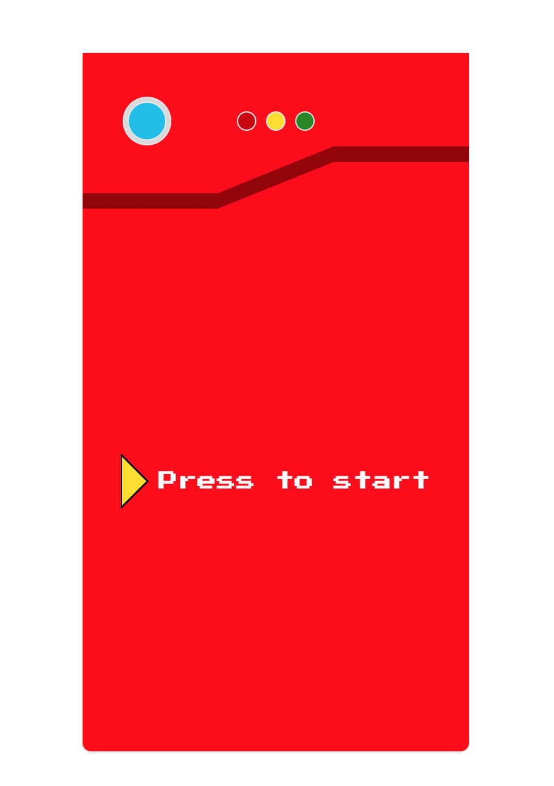
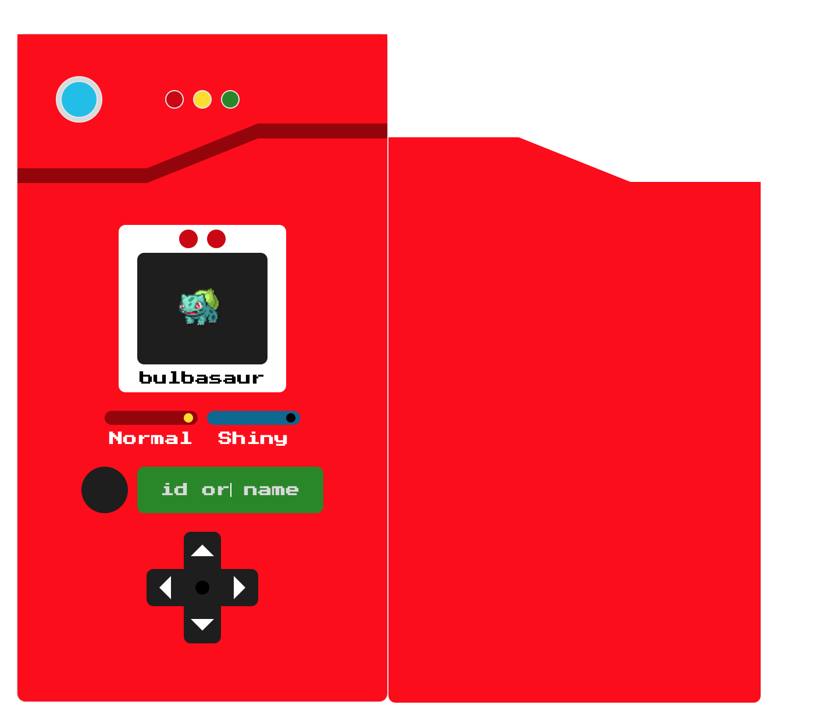

# Practica de pokedex

Para ver una demo de la practica:

- [pokedex-launchxlatam.netlify.app](https://pokedex-launchxlatam.netlify.app)

## Descripción

Esta practica hace uso de la PokeAPI para obtener informacion de los pokemons y mostrarla en una pokedex, el link de la API es: https://pokeapi.co/

## Capturas

### Inicio

### Bulbasaur

## Diseño en Figma PDf

[Link del diseño](./others/pokedexFigma.pdf)
